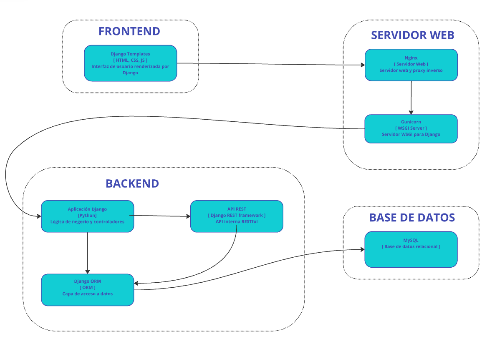

Arquitectura del Sistema
========================

Vista General
-------------

Esta es la vista del sistema en forma general.

.. image:: _static/arquitectura/general.png
   :alt: arquitectura

Vista Detalle 
-------------

El sistema está diseñado siguiendo una arquitectura de múltiples capas que implementa un patrón ``MVC`` (``Modelo-Vista-Controlador``) utilizando el framework ``Django``. La arquitectura está optimizada para proporcionar alta escalabilidad, mantenibilidad y seguridad.
Componentes Principales

Detalle diagrama
----------------
1.  Capa de Presentación (Frontend)

    - ``Django Templates``
        - Propósito: 
            - Manejo de la interfaz de usuario y presentación de datos
        - Tecnologías: 
            - ``HTML``
            - ``CSS``
            - ``JavaScript``
        - Funcionalidades:
            - Renderización de vistas dinámicas
            - Integración con el sistema de templates de Django
            - Gestión de formularios y validación client-side
            - Presentación de datos al usuario final

2.  Capa de Servidor Web

    - ``Nginx``
        - Propósito: 
            - Servidor web y proxy inverso
        - Funcionalidades:
            - Manejo de solicitudes ``HTTP``/``HTTPS``
            - Balanceo de carga
            - Caché de contenido estático
            - Terminación ``SSL``/``TLS``
            - Protección contra ataques DDoS
    - ``Gunicorn``
        - Propósito: Servidor ``WSGI`` (``Web Server Gateway Interface``)
        - Funcionalidades:
            - Gestión de procesos de trabajo (``workers``)
            - Manejo de conexiones concurrentes
            - Interfaz entre Nginx y la aplicación Django
            - Optimización del rendimiento de la aplicación

3.  Capa de Aplicación (Backend)

    - ``Aplicación Django``
        - Propósito: 
            - Núcleo de la lógica de negocio
        - Funcionalidades:
            - Gestión de rutas (``URLs``)
            - Controladores (``views``)
            - Middleware
            - Autenticación y autorización
            - Manejo de sesiones
    - ``API REST``
        - Propósito: 
            - Interfaz de programación de aplicaciones
        - Tecnología: 
            - Django REST Framework
        - Funcionalidades:
            - Endpoints RESTful
            - Serialización de datos
            - Autenticación de API
            - Documentación automática
            - Versionado de API
    - ``Django ORM``
        - Propósito: 
            - Capa de abstracción para acceso a datos
        - Funcionalidades:
            - Mapeo objeto-relacional
            - Gestión de migraciones
            - Validación de datos
            - Consultas optimizadas
            - Caché de consultas

4.  Capa de Datos

    - ``MySQL``
        - Propósito: 
            - Sistema de gestión de base de datos relacional
        - Funcionalidades:
            - Almacenamiento persistente de datos
            - Integridad referencial
            - Backup y recuperación
            - Índices y optimización de consultas

    - ``Flujo de Datos``
        - Flujo de Solicitud:
            - El usuario interactúa con la interfaz en ``Django Templates``
            - La solicitud es recibida por Nginx
            - Nginx direcciona la solicitud a Gunicorn
            - Gunicorn procesa la solicitud y la pasa a ``Django``
        - Procesamiento en ``Django``:
            - La aplicación Django procesa la solicitud
            - Si es necesario, se comunica con la ``API REST``
            - El ``ORM`` gestiona las operaciones de base de datos
            - Los datos son serializados/deserializados según sea necesario
        - Flujo de Respuesta:
            - Django genera la respuesta
            - La respuesta pasa por Gunicorn
            - Nginx envía la respuesta al cliente
            - Los templates renderizan la información al usuario
    - Consideraciones de Seguridad
        - Implementación de ``HTTPS`` a través de ``Nginx``
        - Autenticación y autorización en múltiples niveles
        - Protección contra ataques comunes (``XSS``, ``CSRF``, ``SQL Injection``)
        - Sanitización de datos en todas las capas
        - Logs
    - Escalabilidad y Rendimiento
        - ``Nginx`` proporciona capacidad de balanceo de carga
        - ``Gunicorn`` permite múltiples workers para procesamiento paralelo
        - Optimización de consultas a través del ``ORM``
        - Índices y optimización de base de datos
    - Mantenimiento y Monitoreo
        - Logs centralizados para todas las capas
        - Monitoreo de rendimiento de la aplicación
        - Backup y recuperación de datos
        - Gestión de versiones y migraciones
        - Documentación de ``API`` y código
